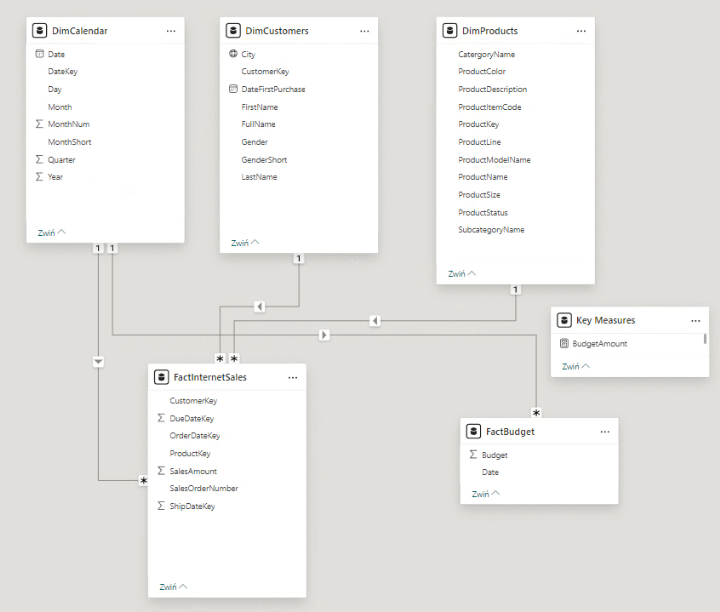
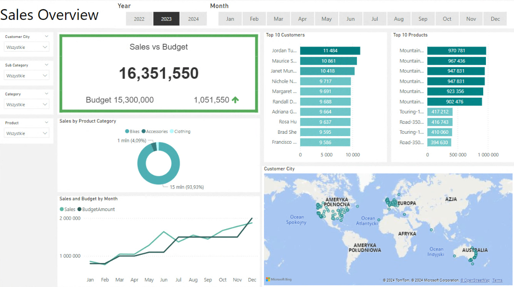

# Introduction
 
The goal of this project was to develop a comprehensive sales report designed to:

1. **Enhance Sales Effectiveness**: Improve the ability to sell individual products to specific customers. 🎯
2. **Monitor Sales Performance**: Display sales trends over time compared to the budget. 📆💹

By achieving these objectives, the sales report will provide valuable insights and support strategic decision-making. 💼🚀

SQL queries: [queries](/sql_queries/)<br />
PowerBI dashoboard: [dashboard](https://app.powerbi.com/groups/me/reports/19bdd338-036c-4fc8-9f96-d4c308cfbdd3/dae6ba23038570bb6835?experience=power-bi)

# Data I Used

Data comes from: [AdventureWorksDW2019.bak](https://learn.microsoft.com/en-us/sql/samples/adventureworks-install-configure?view=sql-server-ver15&tabs=ssms)<br />
Update SQL Data Script: [Update_AdventureWorksDW_Data.sql](https://github.com/techtalkcorner/SampleDemoFiles/blob/master/Database/AdventureWorks/Update_AdventureWorksDW_Data.sql)

# Tools I Used

To create the necessary data model and then present it in the form of a report, I utilized several essential tools:

- **SQL**: Data Cleansing & Transformation.

- **Microsoft SQL Server**: I chose this database management system due to its ease of importing sample Microsoft databases.

- **Git & GitHub**: Crucial for version control and sharing my SQL scripts, facilitating collaboration and project tracking.

- **PowerBI**: Essential for creating business reports.

# Buisness Request

In response to our outlined business requirements, I have developed a comprehensive overview dashboard designed to meet the following key objectives:

- 📊 **Identify Top Customers and Best-Selling Products:** Gain a clear understanding of our highest-spending customers and top-performing products.

- 📈 **Sales Tracking and Budget Comparison:** Monitor sales trends over time and compare them against our budget targets.

- 🌍 **Product Performance by Location:** Analyze sales data to determine which products are performing best in specific regions.

- 🎯 **Customer Insights for Growth Opportunities:** Pinpoint the locations of our customers to identify potential areas for increased sales.

# Data Cleansing & Transformation (SQL)

To perform comprehensive analysis and meet the business requirements, I extracted the following tables using SQL. Additionally, I integrated a data source containing sales budgets in Excel format into the data model during a later stage of the process.

Below, you will find the SQL commands I used for cleaning and transforming the necessary data from the DimProduct table. 📝

```SQL
SELECT 
	p.ProductKey AS ProductKey,
	p.ProductAlternateKey AS ProductItemCode,
	p.EnglishProductName AS ProductName,
	ps.EnglishProductSubcategoryName AS SubcategoryName,
	pc.EnglishProductCategoryName AS CatergoryName,
	p.Color AS ProductColor,
	p.Size AS ProductSize,
	p.ProductLine AS ProductLine,
	p.ModelName AS ProductModelName,
	p.EnglishDescription AS ProductDescription,
	ISNULL (p.Status, 'Outdated') AS ProductStatus 
FROM [AdventureWorksDW2019].[dbo].[DimProduct] AS p
LEFT JOIN dbo.DimProductSubcategory AS ps ON ps.ProductSubcategoryKey = p.ProductSubcategoryKey
LEFT JOIN dbo.DimProductCategory AS pc ON pc.ProductCategoryKey = ps.ProductCategoryKey
```

# Data Model

Below is the data model after I cleansed and prepared the tables for Power BI. This data model illustrates how the FACT_Budget has been seamlessly connected to necessary DIM tables.



# Sales Management Dashboard

Ultimately, I have crafted a Sales Management Dashboard designed to provide insightful analysis and visualizations. The main page serves as a comprehensive overview, while two additional pages delve into detailed data tables and visualizations. These visuals depict sales trends over time, segmented by customers and products. 📊

**Click the picture to open the dashboard and explore its features!** 🚀
[](https://app.powerbi.com/groups/me/reports/19bdd338-036c-4fc8-9f96-d4c308cfbdd3/dae6ba23038570bb6835?experience=power-bi)

# What I Learned

While working on this project, I developed my skills in:

🔧 Data Cleaning and Transformation: I mastered data cleaning and transformation techniques in SQL, enabling me to prepare data effectively for further analysis.

📈 Data Modeling: I built a data model in PowerBI, integrating  also data from an Excel file and creating relationships between tables, which facilitated data analysis and interpretation.

📊 Dashboard Creation: I designed an interactive dashboard in PowerBI, which provides in-depth data analysis and effective visualization of information.